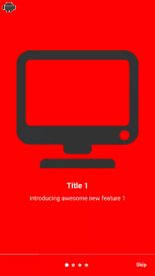

# OnBoardingView

 **OnBoardingView** , a view for quickly crate onboarding screens in kotlin .

##  Motivation

OnBoardingView was built for  learning purposes and engaging in open source .

## Install
- Add jitpack in your root build.gradle at the end of repositories:
```
allprojects {
		repositories {
			...
			maven { url 'https://jitpack.io' }
		}
	}
```
- Add the dependency
```
dependencies {
	    implementation 'com.github.mahmoud-assaf:OnBoardingViewLib:0.3'	}
```

### Features

	 - Quick implmentation.
	 - Custom screen background colors with gradual transition in between .
	- customize forground colors and colors of indicator .
	- callbacks on onboarding finish and onboarding end . 

<br>

### Usage

** include in xml layout**
```
<com.mahmoud.onboardingview.OnBoardingView
        android:id="@+id/onboardingView"
        app:indicatorSelectedColor="@android:color/black"
        app:indicatorUnselectedColor="@android:color/white"
        app:foregroundColor="@android:color/white"
       app:showSeparator="true"
        android:layout_width="0dp"
        android:layout_height="0dp"
        app:appIconRes="@drawable/ic_app"/>

```


```
val onBoardingView=findViewById(R.id.onboardingView)
var screens= arrayListOf<OnBoardingScreen>()  //OnBoardingScreen(titleText: String = "",subTitleText: String = "",drawableResId: Int? = null,screenBGColor: Int = Color.WHITE)
screens.add(
   OnBoardingScreen(titleText = "Title 1",subTitleText = "introducing awesome new feature  1 ", screenBGColor = Color.RED,drawableResId = R.drawable.im1
))
screens.add(
    OnBoardingScreen(
        titleText = "Title 2",subTitleText = "introducing awesome new feature  2 ",drawableResId = R.drawable.im2,screenBGColor =  Color.parseColor("#FE6F0C")
    ))
screens.add(
    OnBoardingScreen(
        titleText = "Title 3",subTitleText = "introducing awesome new feature  3 ",drawableResId = R.drawable.im3,screenBGColor =Color.MAGENTA
    ))
screens.add(
   OnBoardingScreen(
        titleText = "Title 4",subTitleText = "introducing awesome new feature  4 ",screenBGColor = Color.RED,drawableResId = R.drawable.im4
    ))

onBoardingView.setScreens(screens)
onBoardingView.onEnd {
    //finish()
    Toast.makeText(this,"OnBoarding Finished",Toast.LENGTH_SHORT).show()
}

onBoardingView.onFinish {
    Toast.makeText(this,"OnBoarding last screen",Toast.LENGTH_SHORT).show()
    return@onFinish false     // return false will not trigger this action again(on swipe back ) , true will trigger it with every swipe to last screen , may used for showing some animation or something

}


```


##  License
[Apache 2](https://www.apache.org/licenses/LICENSE-2.0)
